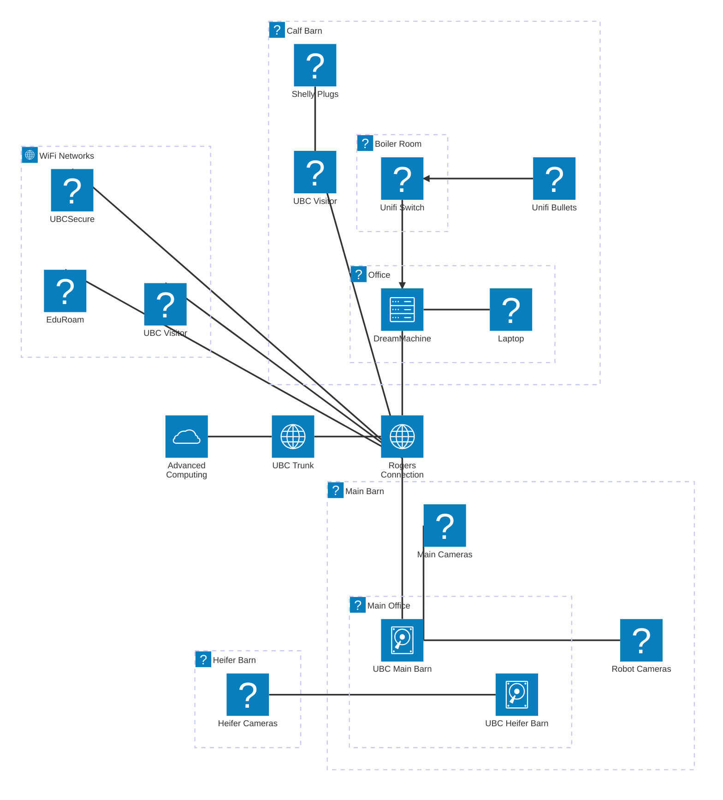

# Camera Administration

## The Camera Network

```mermaid
architecture-beta
    group mainbarn(mdi:barn)[Main Barn]
    group heiferbarn(mdi:barn)[Heifer Barn]
    group calfbarn(mdi:barn)[Calf Barn]
    group calfoffice(mdi:barn)[Office] in calfbarn
    group calfboiler(mdi:barn)[Boiler Room] in calfbarn
    group wireless(internet)[WiFi Networks]
    group barnoffice(mdi:barn)[Main Office] in mainbarn

    service rogers(internet)[Rogers Connection]
    service internet(internet)[UBC Trunk]
    service dream(server)[DreamMachine] in calfoffice
    service switch(typcn:flow-switch)[Unifi Switch] in calfboiler
    service camerabullet(material-symbols:camera-video)[Unifi Bullets] in calfbarn
    service visitorcalf(material-symbols:wifi)[UBC Visitor] in calfbarn
    service visitor(material-symbols:wifi)[UBC Visitor] in wireless
    service eduroam(material-symbols:wifi)[EduRoam] in wireless
    service secure(material-symbols:wifi)[UBCSecure] in wireless
    service shelly(cbi:shelly-logo)[Shelly Plugs] in calfbarn
    service laptop(mdi:laptop)[Laptop] in calfoffice
    service arc(cloud)[Advanced Computing]
    service unvr(disk)[UBC Main Barn] in barnoffice
    service unvrheifer(disk)[UBC Heifer Barn] in barnoffice
    service camerahb(material-symbols:camera-video)[Heifer Cameras] in heiferbarn
    service camerag4(material-symbols:camera-video)[Robot Cameras] in mainbarn
    service cameramain(material-symbols:camera-video)[Main Cameras] in mainbarn
camerahb:R -- L:unvrheifer
rogers:L -- R:internet
internet:L -- R:arc
dream:B -- T:rogers
switch:B --> T:dream
switch:R <-- L:camerabullet
visitorcalf:T -- B:rogers
visitor:T -- B:rogers
secure:T -- B:rogers
eduroam:T -- B:rogers
shelly:B -- T:visitorcalf
laptop:L -- R:dream
unvr:T -- B:rogers
cameramain:L -- R:unvr
camerag4:L -- R:unvr
```

## Troubleshooting

You can find reporting of issues we've encountered on the [Troubleshooting](troubleshooting.md) page.
