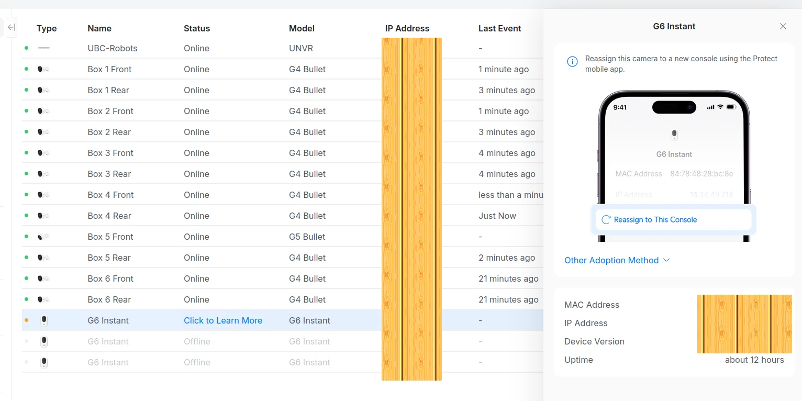

# Troubleshooting

## Gotcha: Cameras Appearing on Multiple Consoles

When manually inventorying cameras through each console's Protect UI,
you may see the same physical camera appear in more than one
console's device list, even though a camera can only be actively
adopted/managed by one console at a time.

<figure markdown="span" style="display:table;margin-block: 0;margin-inline: auto;">
  { width="80%" }
<figcaption style="display:table-caption;caption-side:bottom;margin-block-start: .5em;"><b>Figure</b>. The Unifi Protect panel showing a camera (G6 Instant) with an organge "warning" dot, and an inset to the right showing the camera is assigned to another console. All IP and MAC addresses have been anonymized.</figcaption>
</figure>

### Why This Happens

UniFi Protect can discover cameras on the local network via
broadcast/mDNS, independent of which console has actually adopted
them. If two consoles share the same physical network segment, each
console's UI may show cameras that are:

- **Adopted and managed by this console**, or
- **Visible on the network, but managed by a different console**

Both can appear in the same list, and it's easy to mistake the second
category for cameras belonging to the console you're currently
viewing.

### How to Tell the Difference

**[TBD — confirm exact UI indicator]**: when you encountered this,
what did the UI show to distinguish an adopted camera from one
managed elsewhere? (e.g., a status badge, greyed-out entry, specific
label text?) Documenting the precise wording/indicator here will
make this page actually useful rather than a vague warning.

### Practical Recommendation

When inventorying cameras manually:

- Don't rely solely on a camera's presence in a console's device list
- Check the specific adoption/management status for each entry
  before recording it against that console in `cameras.csv`
- If two consoles are on the same physical network, expect this
  overlap and double-check any camera that seems to appear in both